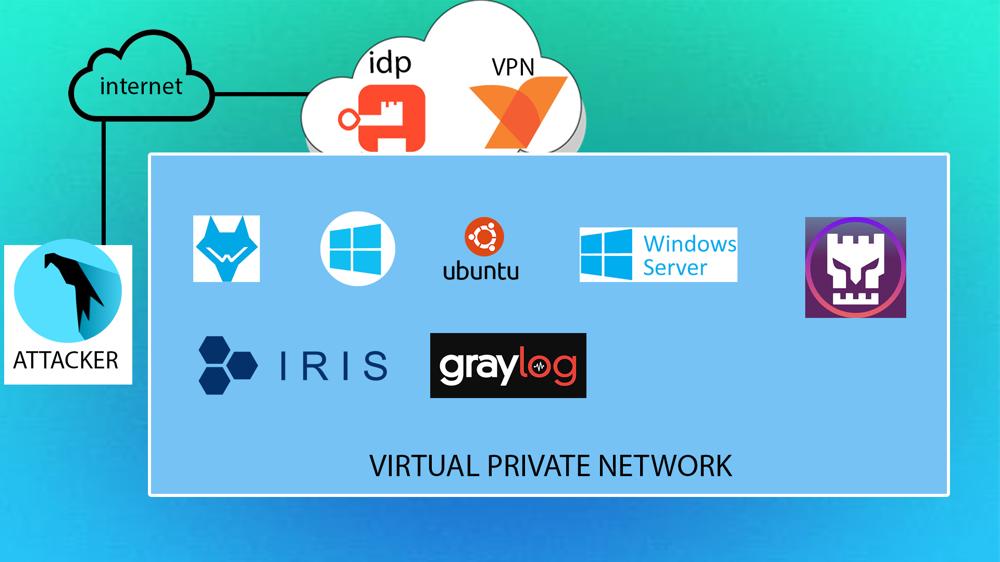

# Configuration Guide Index

Welcome to the Configuration Guide! Below you'll find links to detailed configuration guides for various tools and systems.

## Configuration Guides

1. [Wazuh Configuration Guide](Wazuh.md)  
   Learn how to install and configure Wazuh for security monitoring, threat detection, and compliance auditing.

2. [IRIS Configuration Guide](IRIS.md)  
   Discover how to set up and configure the IRIS platform for threat intelligence and incident response.

3. [Graylog Configuration Guide](Graylog.md)  
   Explore the steps to install and configure Graylog for log management and real-time analysis.

4. [SOC Fortress Copilot Configuration Guide](soc_fortress_copilot.md)  
   Understand how to deploy and manage SOC Fortress Copilot for comprehensive security monitoring.

5. [Windows Server Configuration Guide](windows_server.md)  
   A guide to installing and configuring Windows Server for enterprise-grade operations.

6. [Ubuntu Configuration Guide](ubuntu.md)  
   Instructions on installing and configuring Ubuntu, a widely-used Linux distribution.

7. [Windows Configuration Guide](windows.md)  
   Steps to install and customize Windows for both personal and enterprise use.

8. [Authentik & Netbird Configuration Guide](authentik_netbird.md)  
   Learn how to set up Authentik as an identity provider and Netbird for secure networking.

---

## Image Reference

Here is a visual representation of the infrastructure setup:

---

## How to Use

Click on any of the links above to be redirected to the detailed configuration guide for that specific tool or system.

If you have any questions or run into issues, feel free to open an issue in this repository.
