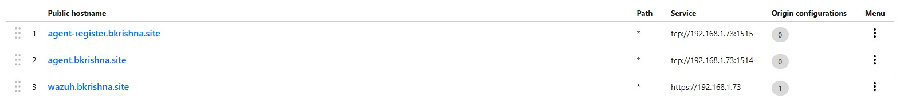
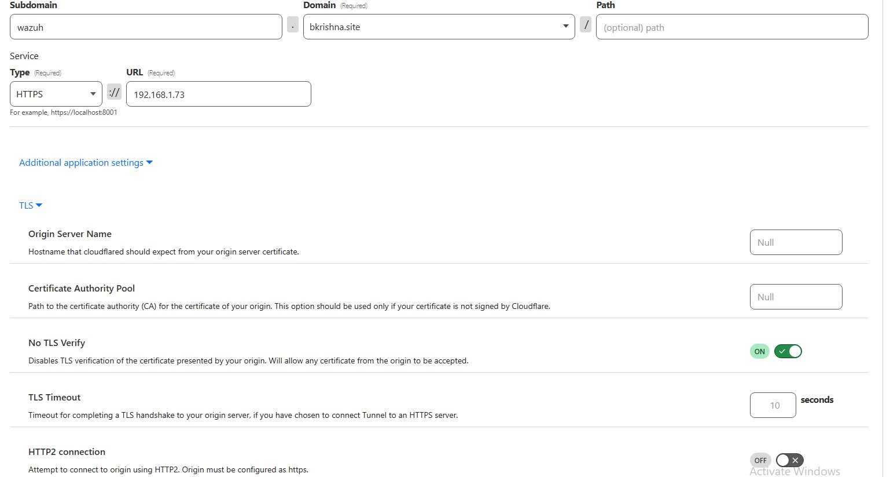

# Wazuh Integration with Cloudflare and Windows Endpoints

#Reference Documentation
1. [Wazuh Quickstart Documentation](https://documentation.wazuh.com/current/quickstart.html)
2. .[CloudFlare TCP Tunnels](https://developers.cloudflare.com/cloudflare-one/applications/non-http/cloudflared-authentication/arbitrary-tcp/#connect-from-a-client-machine)


## 1. Configure Your Domain with Cloudflare
Buy a domain and configure it to cloudflare dns servers or you can transfer domain to cloudflare just by changing name servers where you brought domain.

## 2. Wazuh Server Installation, Configuration & Connecting to Cloudflare

### Install Wazuh in Ubuntu Server
Refer to the [Wazuh Quickstart Documentation](https://documentation.wazuh.com/current/quickstart.html) for installation steps.


### Configure the Wazuh Manager
Before proceeding with the Windows agent, ensure the Wazuh Manager is configured to use a password.

#### a) Modify the `<auth>` Section
1. Open the `ossec.conf` file on the Wazuh Manager:
2. Open the configuration file in nano editor
    ```bash
    sudo nano /var/ossec/etc/ossec.conf  
    ```
3. Ensure the `<auth>` section has `use_password` enabled:
    ```xml
    <auth>
        <disabled>no</disabled>  <!-- Ensures authentication is enabled -->
        <port>1515</port>  <!-- Defines the port used for authentication -->
        <use_source_ip>no</use_source_ip>
        <purge>yes</purge>
        <use_password>yes</use_password>  <!-- Enables password authentication -->
        <ciphers>HIGH:!ADH:!EXP:!MD5:!RC4:!3DES:!CAMELLIA:@STRENGTH</ciphers>  <!-- Defines strong encryption ciphers -->
        <!-- <ssl_agent_ca></ssl_agent_ca> -->
        <ssl_verify_host>no</ssl_verify_host>
        <ssl_manager_cert>etc/sslmanager.cert</ssl_manager_cert>
        <ssl_manager_key>etc/sslmanager.key</ssl_manager_key>
        <ssl_auto_negotiate>no</ssl_auto_negotiate>
    </auth>
    ```
4. Save the file and restart the Wazuh Manager:
   ```bash
    sudo systemctl restart wazuh-manager
    ```

#### b) Set a Password for Enrollment
1. On the Wazuh Manager, open or create the password file:
    ```bash
    sudo nano /var/ossec/etc/authd.pass
    ```
2. Add your password (e.g., `MySecurePassword123`):
    ```
    MySecurePassword123
    ```
3. Secure the file by changing permissions:
    ```bash
    sudo chmod 600 /var/ossec/etc/authd.pass
    
    ```

#### b)Install cloudflared on Linux

Run the following commands:

```bash
curl -L --output cloudflared.deb https://github.com/cloudflare/cloudflared/releases/latest/download/cloudflared-linux-amd64.deb && \
sudo dpkg -i cloudflared.deb && \
sudo cloudflared service install <Auth key>

```


As per below images forward ports 1515 for agent-register,1514 for agent comunication,443 for web UI,U can also forward 55000 for API but uts optional.




## 3. Configuration of Wazuh in Windows Endpoint

### Install Wazuh Agent in Windows Endpoint
Refer to the [Wazuh Agent Installation Guide](https://documentation.wazuh.com/current/installation-guide/wazuh-agent/wazuh-agent-windows.html) for installation steps.

### Configure the Windows Agent
1. Open the Wazuh Agent installation directory (default location):
   Navigate to the installation directory
   ```
    C:\Program Files (x86)\ossec-agent\ 
    ```
3. Open the `ossec.conf` file with a text editor (e.g., Notepad++).
4. Add the Wazuh Manager details under the `<server>` section:
    ```xml
    <server>
        <address>127.0.0.1</address>  <!-- Set to the Wazuh Manager's IP or hostname -->
        <port>4544</port> <!-- Instead of 1514, we use 4544,we are using 4544 for cloud flare tcp configuration -->
    </server>
    ```
5. Save and close the file.

## 4. Creating a Scheduled Task

### Install Cloudflared in Windows
Refer to the [Cloudflare Zero Trust Documentation](https://developers.cloudflare.com/cloudflare-one/connections/connect-apps/install-and-setup/) for download links.

### Configure the Scheduled Task
1. In the "Add arguments" field, enter the following:
    ```powershell
    -NoProfile -WindowStyle Hidden -Command "Start-Process -FilePath 'cloudflared' -ArgumentList 'access tcp --hostname agent-register.bkrishna.site --url 127.0.0.1:4545' -NoNewWindow; Start-Process -FilePath 'cloudflared' -ArgumentList 'access tcp --hostname agent.bkrishna.site --url 127.0.0.1:4544' -NoNewWindow"
    ```
    - This command starts Cloudflared processes to securely tunnel traffic to Wazuh.
2. Click **OK**.

### Conditions Tab
- Uncheck **Start the task only if the computer is on AC power** to ensure it runs even on battery (if applicable).

### Settings Tab
- Check **Allow task to be run on demand**.
- Check **If the task fails, restart every** and set retry attempts as needed (e.g., 3 times every 1 minute).

### Save the Task
1. Click **OK**.
2. When prompted, enter the credentials of an account with administrative privileges.

### Enable Task to Run Without User Login
1. **Use a System-Wide Account**
   - The task account should ideally be a system account or a service account with sufficient privileges.
   - If using a local administrator account, ensure it has **Log on as a service** rights.
2. **Modify Group Policy (if needed)**
   - Open Local Group Policy Editor (`gpedit.msc`).
   - Navigate to:
     ```
     Computer Configuration > Windows Settings > Security Settings > Local Policies > User Rights Assignment
     ```
   - Look for **Log on as a service**, and ensure the account running the task is listed.

### Test the Task
- Reboot the system to confirm that the commands run at startup.
